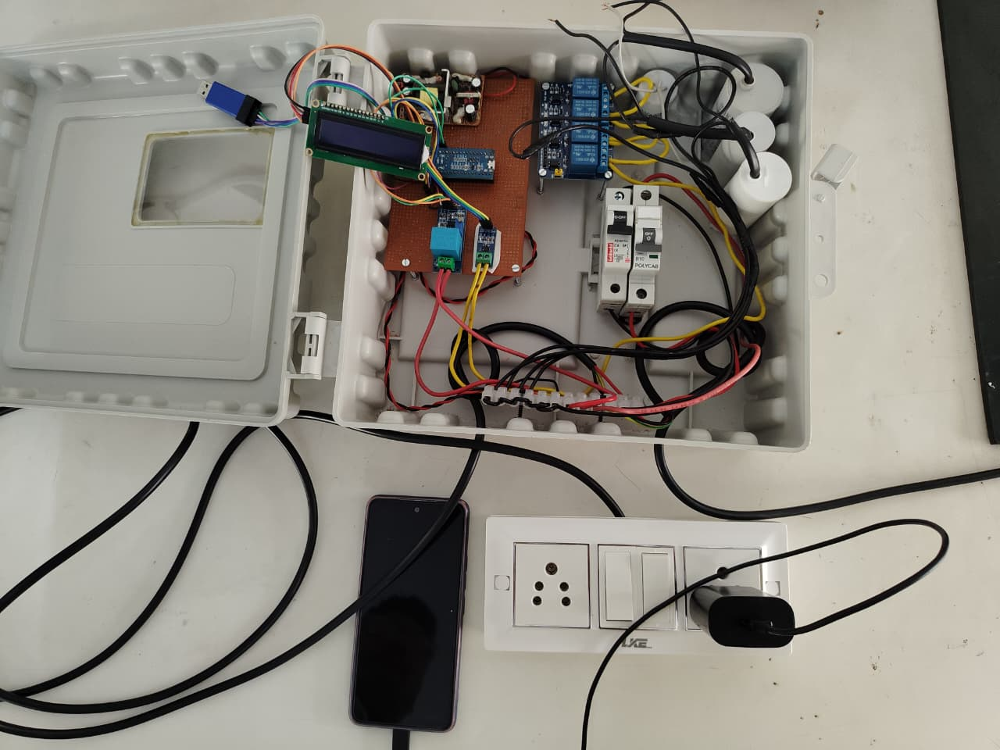
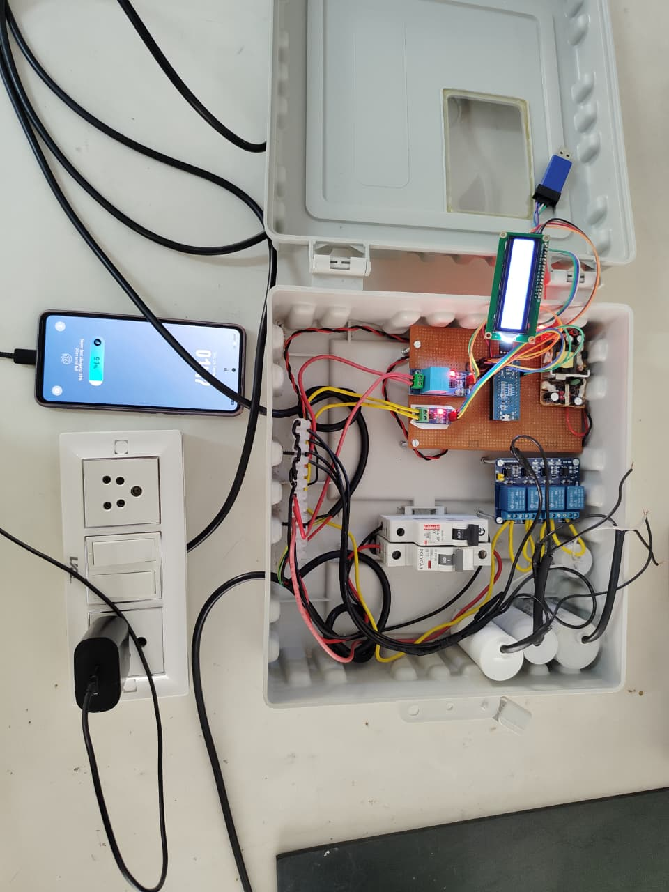
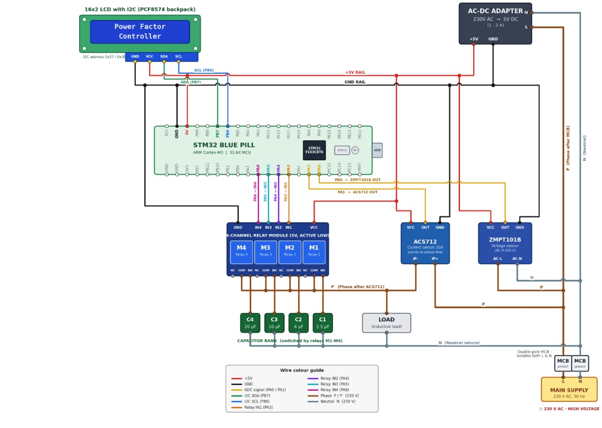
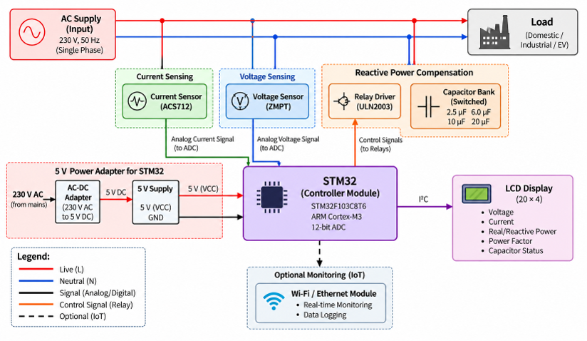

# Automatic Power Factor Correction System using STM32

## 📌 Project Overview

The **Automatic Power Factor Correction (APFC) System** is an embedded system designed to monitor and improve the power factor of an electrical load by automatically switching capacitor banks according to the measured power factor.

The system uses an **STM32F103C8T6 microcontroller** to acquire voltage and current signals, calculate electrical parameters, determine the power factor, and control capacitor banks through relays. An LCD is used to display the measured electrical parameters in real time.

The primary objective is to reduce reactive power demand and improve the overall efficiency of the electrical system.

---

## 🎯 Objectives

- Measure AC voltage and load current.
- Calculate real power and power factor.
- Continuously monitor the power factor of the load.
- Automatically switch capacitor banks based on the measured power factor.
- Reduce reactive power demand.
- Improve the overall power factor of the electrical load.
- Display electrical parameters using an LCD.

---

## ⚙️ System Features

- STM32-based embedded control system
- Real-time voltage and current measurement
- Power factor calculation
- Automatic capacitor-bank switching
- Relay-based control
- LCD-based parameter monitoring
- Configurable capacitor combinations
- Embedded C firmware developed using STM32CubeIDE

---

## 🧩 System Architecture

The major functional blocks of the system are:

```text
             AC Supply
                 │
                 ▼
        ┌──────────────────┐
        │ Voltage & Current│
        │     Sensors      │
        └────────┬─────────┘
                 │
                 ▼
        ┌──────────────────┐
        │      STM32       │
        │   Microcontroller│
        └───────┬──────────┘
                │
        ┌───────┴──────────┐
        │                  │
        ▼                  ▼
 ┌─────────────┐     ┌─────────────┐
 │     LCD     │     │ Relay Driver│
 │  Display    │     │   ULN2003A  │
 └─────────────┘     └──────┬──────┘
                            │
                            ▼
                    ┌──────────────┐
                    │ Capacitor    │
                    │    Bank      │
                    └──────────────┘
                            │
                            ▼
                         Load
```

---

## 🔧 Hardware Components

| Component | Purpose |
|---|---|
| **STM32F103C8T6 Blue Pill** | Main controller |
| **Voltage Sensor / PT** | AC voltage measurement |
| **Current Sensor / CT** | Load current measurement |
| **Capacitor Bank** | Reactive power compensation |
| **Relay Module** | Capacitor switching |
| **ULN2003A** | Relay driver |
| **20×4 I2C LCD** | Real-time parameter display |
| **Power Supply** | Provides regulated DC power to the control circuit |

---

## 💻 Software & Development Tools

- **STM32CubeIDE**
- **STM32CubeMX**
- **Embedded C**
- **STM32 HAL Library**
- **Git & GitHub**

---

## 🔄 Working Principle

1. The AC supply is connected to the electrical load.
2. Voltage and current sensors provide scaled signals to the STM32 ADC.
3. The STM32 samples the voltage and current waveforms.
4. Electrical parameters are calculated from the sampled signals.
5. The power factor is determined from the measured electrical parameters.
6. If the power factor falls below the defined limit, the controller calculates the required compensation.
7. The appropriate capacitor combination is selected.
8. Relays are activated through the ULN2003A driver to connect the required capacitors.
9. The corrected power factor is continuously monitored.
10. The measured parameters are displayed on the LCD.

---

## 🧮 Automatic Capacitor Switching

The system uses multiple capacitor stages to provide different levels of reactive power compensation.

The STM32 determines the required capacitance and selects the most suitable capacitor combination based on the measured power factor and load condition.

This allows the system to provide automatic compensation instead of manually switching capacitors.

---

## 📊 Parameters Monitored

The system monitors and displays parameters such as:

- AC Voltage
- Load Current
- Real Power
- Power Factor
- Capacitor Switching Status

---

## 📷 Project Hardware

### Complete Prototype




### Circuit Diagram



### Block Diagram



> **Note:** Replace the image filenames above with the exact names of the photographs uploaded to `Hardware/Photos/`.

---

## 📁 Repository Structure

```text
Automatic-Power-Factor-Correction-System-using-STM32-cube-IDE/
│
├── Core/
│   ├── Inc/
│   └── Src/
│
├── Drivers/
│
├── Hardware/
│   └── Photos/
│
├── Documentation/
│
├── Power_Factor.ioc
│
└── README.md
```

---

## 📚 Documentation

Additional project documentation, diagrams, reports, and supporting material are available in the [`Documentation`](Documentation/) folder.

---

## 👥 Team Members

**Atharvaraj Mali**  
Electronics and Telecommunication Engineering

**Samarth Salunkhe**  
Electronics and Telecommunication Engineering

This project was developed collaboratively as a capstone project.

---

## 🚀 Future Scope

- Higher-capacity capacitor-bank control
- Three-phase APFC implementation
- Improved measurement accuracy
- Industrial-grade protection and isolation
- Advanced data logging and analysis
- Integration with a dedicated energy-monitoring interface

---

## 📜 License

This project is developed for **academic and educational purposes**.

---

## ⭐ Acknowledgement

We would like to thank our project mentors, faculty members, and department for their guidance and support throughout the development of this project.
